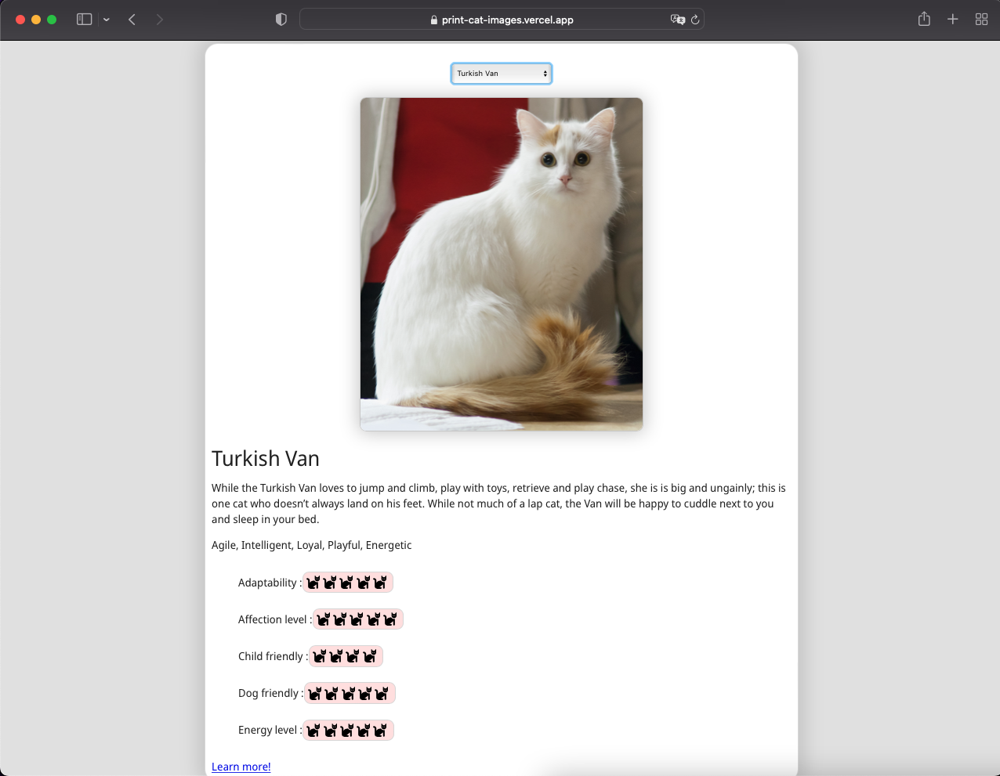

# Print Dog Images
Aplicativo que interage com "The Cat API" e mostra para o usuário imagens e características de um gato selecionado.

### Funcionalidades
<ul>
  <li> O App tem uma lista para selecionar uma de várias raças que estão presentes na API. </ li>
  <li> Quando uma raça é selecionada, uma foto aleatória da mesma é exibida. </ li>
  <li> Quando uma raça é selecionada, uma descrição da mesma é exibida. </ li>
  <li> Quando uma raça é selecionada, as características da mesma são exibidas. </ li>
</ul>

### Tecnologias e ferramentas
<ul>
  <li> ReactJS </ li>
  <li> Api fetch </ li>
  <li> CSS </ li>
</ul>

### App
Link para o <a href="https://print-dog-images.vercel.app/"> App </a>.

Link para a <a href="https://thecatapi.com/"> API </a>.
